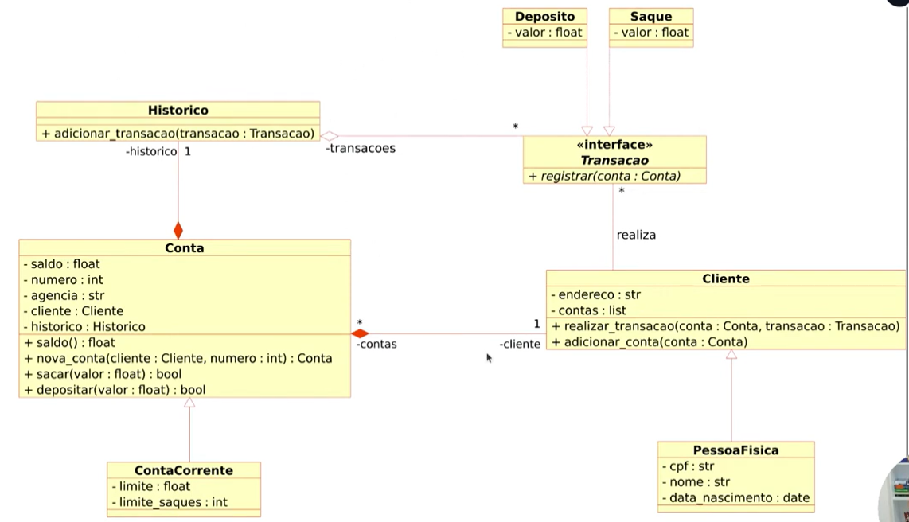

# BootCamp DIO & NTT Data Engenharia de Dados com Python 🐍 (*Desafio 04*)
###### (Desafio ==> 04 - Transformar o código para o paradigma POO)
  
## 🎯Objetivo:
Alterar o sistema bancário, criado anteriormente nos desafios, para iniciar a modelagem do sistema bancário em POO.
Adicionar classes para cliente e para as operações bancárias existentes: *depósito* e *saque*.  
  
O intuito é aplicar tudo que foi aprendido até essa etapa.  
  

## 🤓Entendendo o Desafio:
>Após desenvolvermos o sistema bancário para um grande banco.  
Esse banco deseja avançar com a modernizar, implementando novas funcionalidades.  
**Precisamos atualizar a implementação do sistema bancário, para armazenar os dados de clientes e contas bancárias em _objetos_ ao invés de _dicionários_.  
O código deve seguir o modelo de classes UML abaixo.**  
Será a oportunidades de aplicarmos o conhecimento adquirido no Python sobre funções.
    

  
- 🗺️Template do código (Desafio 4)  
Vou implementar o código para esse Desafio 4, considerando como ponto de partida:  
     - O template do Desafio 3, o último que fiz, e consta no GitHub:  
     [DIO_NTT_EngDados_DESAFIO_03_criando_sistema_bancario_vFcs_User_Conta.py](https://github.com/Roberto-Pfaltzgraff/estudos_prg-Python/blob/main/DIO/NTT_EngDados/Desafios/DIO_NTT_EngDados_DESAFIO_03_criando_sistema_bancario_vFcs_User_Conta.py)  

## 🤓Desafio Feito😎! Minha resolução🎉🎉🎉:
> Veja a solução deste desafio 4, no código do meu git:  
> 📋- [DIO_NTT_EngDados_DESAFIO_04_criando_sistema_bancario_vPOO.py](https://github.com/Roberto-Pfaltzgraff/estudos_prg-Python/blob/main/DIO/NTT_EngDados/Desafios/DIO_NTT_EngDados_DESAFIO_04_criando_sistema_bancario_vPOO.py)  
  
